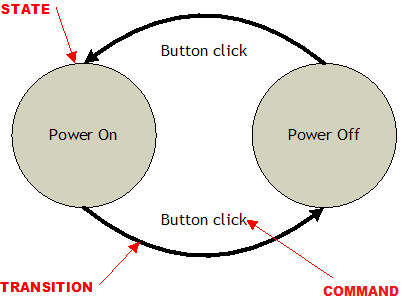

# Fluent Machines

FluentMachines is an .NET Core library born with the ambition to make finite state machines easy to configure, implement and maintain.

Happy coding!

## Getting Started

Download the solution by cloning project git repository in your local directory by using the following command:

```
git clone https://github.com/joovnaz/fluentmachines.git
```

Alternatively download and extract a copy of repository ZIP file.

### Dependencies

FluentMachine was developed with Visual Studio (2017) and has no dependencies. 
The unit tests project use:

* [xUnit.net] (https://github.com/xunit/xunit) 
* [FluentAssertions] (https://github.com/fluentassertions/fluentassertions) 

## Starting With A Simple "On-Off" Machine

We get started by setting up an easy "On-Off" bi-states machine following 4 steps.

A basic graphical representation is sketched hereafter



### Step 1: Defining States and Commands

Start defining machine states through a **struct** structure, such as:

```
public struct States
{
    public const string PowerOn = "PowerOn";

    public const string PowerOff = "PowerOff";
}
```

Put machine commands in second **struct** definition. 

The "On-Off" machine needs only one command called *ButtonClickCommand*:

```
public struct ButtonClickCommand : ICommand
{
    public string Payload { get; set; }
}
```

Please notice that FluentMachine requires any command to implement *ICommand* interface. 

This simply means implementing a read/write property called **Payload** (but forget such detail for a moment). 

Great, first step is completed.

### Step 2: Mapping States

To map the machine states you firstly instantiate FluentMachines engine:

```
var engine = new Engine();
```
Then map *States* and set both "Start" and "End" states, like: 

```
engine.Map<States>().StartsWith(States.PowerOn).NeverEnding();
```

Clearly, our "On-Off" machine will never reach an "End" state, because will indefinitively flip between "Power On" and "Power Off" states.

### Step 3: Adding Transitions

A transition is a machine state change triggerd by a command.

Our "On-Off" machine requires two transitions: from "Power On" to "Power Off" states and the other way around.

Both transitions get triggered by a *ButtonClickCommand*.

By coding:

```
engine.AddTransition().From(States.PowerOn).To(States.PowerOff).Accept<ButtonClickCommand>();

engine.AddTransition().From(States.PowerOff).To(States.PowerOn).Accept<ButtonClickCommand>();
```

Very good. 

Now let's power on our machine and gear up!

### Step 4: Power On the Machine 

Power on the machine:

```
engine.PowerOn();
```

**WARNING:** Please do not get misled by engine power-on and machine "Power On" states, clearly they are two separate concepts.

Start executing commands:

```
engine.Execute(new ButtonClickCommand());
```

The engine will change its state accordingly to settings. 

You can check the "On-Off" machine state by retrieving its current state, for example:

```
if (engine.GetCurrentState() == States.PowerOff) {

	// Do Something...
}
```

Find more details in FluentMachine.xUnitTests project.


## All Together...

Finally, our "On-Off" state machine code looks like

```
public struct States
{
    public const string PowerOn = "PowerOn";

    public const string PowerOff = "PowerOff";
}

public struct ButtonClickCommand : ICommand
{
    public string Payload { get; set; }
}

public class OnOffStateMachine {

	private Engine engine;

	public void Setup() {
		
		var engine = new Engine();

		engine.Map<States>().StartsWith(States.PowerOn).NeverEnding();

		engine.AddTransition().From(States.PowerOn).To(States.PowerOff).Accept<ButtonClickCommand>();
		
		engine.AddTransition().From(States.PowerOff).To(States.PowerOn).Accept<ButtonClickCommand>();

	}

	public void Run() {
		...
	}
}

```

Overall the state machine gets built with less than ten lines of code, not that bad.

## Handling Exceptions

Once states are mapped, any invalid state passed to the engine would throw an *InvalidStateException*. 

A similar behaviour occurs for commands. Trying to execute not accepted commands will throw an *InvalidCommandException*.

If the fluent machine is in End state, trying to execute any command will throw a *ReachedEndStateException*.

## Using Actions

An action is any "logic" (i.e. represented by a delegate function) triggered by a command.

The action signature is:

```
public delegate bool ActionDelegate(ICommand command);
```

An action receives a command as input and returns a boolean value to inform the machine to switch (or not) state.

For example, back to our "On-Off" machine imagine we want to make some checks before switching from "Power Off" to "Power On" state. 

We want the "On-Off" machine to switch-on only in the afternoon, say after 2pm and before 6pm.

First, define an action as follow:

```
public struct Actions
{
    public static bool SwitchOnBetween2PMAnd6PM(ICommand command)
    {
        return DateTime.Now.Hour % 6 == 2;
    }
}
```

Then replace the above transition statement with

```
engine.AddTransition()
	  .From(States.PowerOff).To(States.PowerOn)
	  .Process<ButtonClickCommand>().With(Actions.SwitchOnBetween2PMAnd6PM);
```

Done.

## State Changes Journal

The engine instance contains a **Journal** property with all states changes occured, both switched and not.

To access the oldest (first on time order) states change

```
var journal = engine.Journal;

var firstStateChange = engine.Journal.GetAllItemsOrderByTimestamp().FirstOrDefault().StateChange;
```

The *StateChange* class properties are 

```
string From			// from state

string To			// to state

bool HasSwitched	// has swithed 

string Command		// class name that triggered the states change
```

## Persisting The Machine States

...(coming soon)


## Connecting *Slave* Data Objects

...(coming soon)

## Authors

* **Joovnaz** - *Initial work* 

## License

This project is licensed under the Apache Version 2.0 - see the [LICENSE](LICENSE) file for details

## Acknowledgments

* Thanks so much to all developers that inspired me over time!
* Among others: Robert "Uncle Bob" Martin, Kent Beck, Martin Fowler, Erich Gamma, Eric Evans, Vladimir Khorikov, ... uhff
